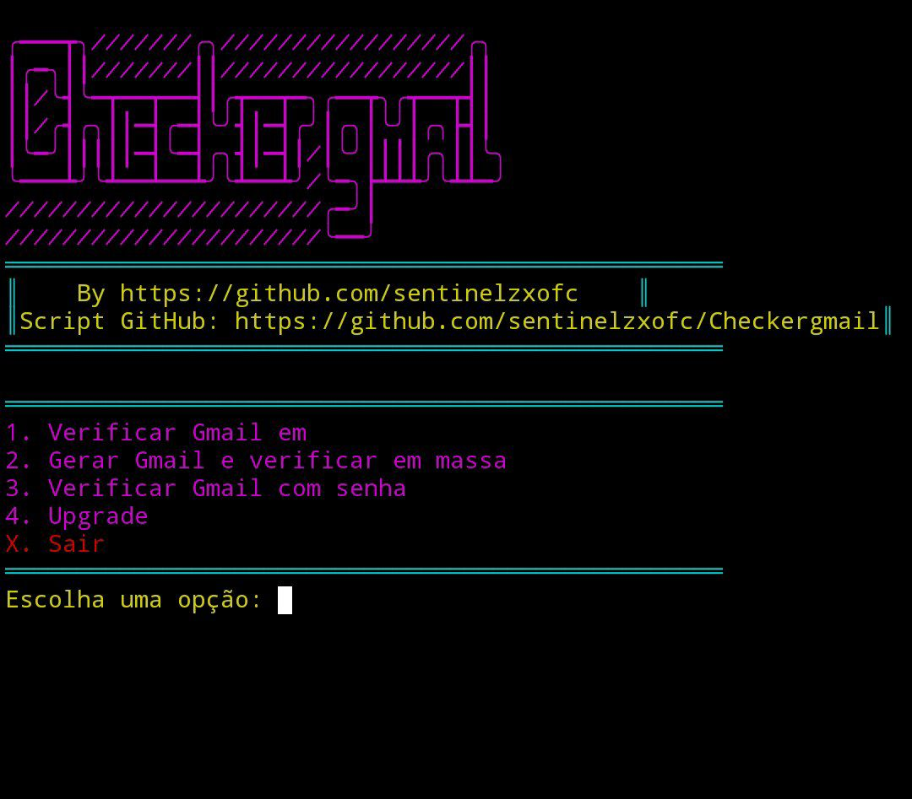
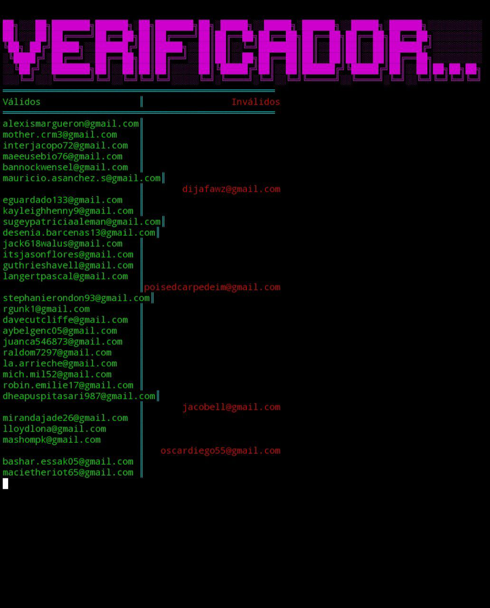

<h1 align="center">
  <br>
  🔥 Checker Gmail 🔥
</h1>

<p align="center">
  
</p>

---

### 🚀 **Sobre o projeto**
✔️ Verifique se um e-mail do **Gmail** é válido ou inválido  
✔️ Verificação em **massa** usando listas de e-mails  
✔️ Interface **colorida e interativa**  
✔️ **Código atualizado automaticamente** com suporte ao GitHub  

---

### 🎮 **Instalação e Uso**

```bash
# Clone o repositório
git clone https://github.com/sentinelzxofc/Checkergmail

# Acesse a pasta do projeto
cd Checkergmail

# Instale as dependências (caso necessário)
bash install.sh

# Execute o script
python3 gmail_checker.py
```

---

### 📌 **Pré-requisitos**
Antes de rodar o script, instale as bibliotecas necessárias:

```bash
pip install smtplib socket requests colorama
```

---

### 📷 **Demonstração**
<p align="center">
  
</p>

---

### ⚡ **Contato & Suporte**
📧 Email: [suportegitzx@gmail.com](mailto:suportegitzx@gmail.com)  
🐱 GitHub: [sentinelzxofc](https://github.com/sentinelzxofc)  

🌟 **Se gostou do projeto, deixe uma ⭐ no repositório!**  

---

### 🎭 **Créditos**
By [sentinelzxofc](https://github.com/sentinelzxofc)  
